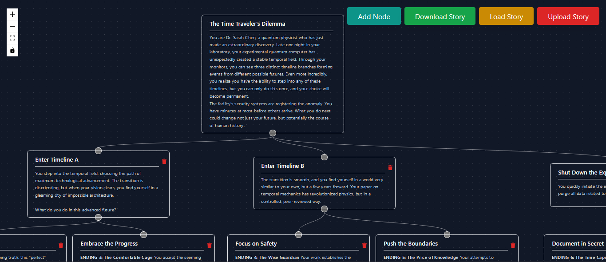
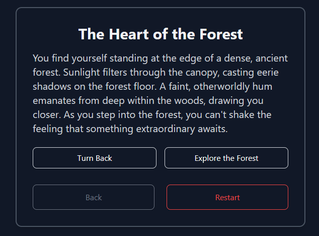

<picture>
  <source media="(prefers-color-scheme: dark)" srcset=".\frontend\public\logo_dark.png">
  <source media="(prefers-color-scheme: light)" srcset=".\frontend\public\logo.png">
  
</picture>

Welcome to the **Stories Website**! This project is an interactive platform that lets users create and explore dynamic stories through connected cards on a graphical canvas. Built using the **MERN Stack** (MongoDB, Express, React, Node.js) and styled with **Tailwind CSS**, this fully functional application includes user authentication and a visually engaging interface.

### 🌐 [Visit the Deployed Website](https://stories-frontend.onrender.com/)
- The server might take some time to spin up

## Features

- **Graphical Canvas**: 
  - Drag-and-drop cards to build story nodes.
  - Connect cards with links to form a tree structure.
  - Intuitive navigation through story paths.
  
- **Create and Explore Stories**: 
  - Add titles and content to cards.
  - Traverse stories using different options to explore linked nodes.

- **Authentication**:
  - Secure login, signup, and logout for user accounts.

- **Responsive Design**:
  - Mobile and desktop-friendly interface with dark mode styling.


## Tech Stack

### Frontend:
- **React.js**: For dynamic, component-driven user interfaces.
- **Tailwind CSS**: Utility-first styling framework for a modern and responsive design.

### Backend:
- **Node.js**: Server-side runtime environment.
- **Express.js**: Minimal web application framework for routing and APIs.
- **MongoDB**: Flexible, schema-less NoSQL database.


## Environment Configuration

To run the project locally, set up the following `.env` files for the **frontend** and **backend**:

### Frontend (`frontend/.env`)
```env
REACT_APP_BACKEND_URL="http://localhost:5000/api"
# Ensure the backend URL ends with "/api" for correct API routing.
```

### Backend (`backend/.env`)
```env
MONGO_URI="mongodb+srv://<your-mongo-connection-string>"
PORT=5000
JWT_SECRET=secret
FRONTEND_URL="http://localhost:3000"
```


## Installation and Setup

### Prerequisites
- **Node.js** (v14 or above)
- **MongoDB** (local instance or cloud cluster)

### Steps to Run Locally
1. **Clone the repository**:
   ```bash
   git clone https://github.com/DragonRider01598/stories.git
   cd stories
   ```

2. **Install dependencies**:
   - For the frontend:
     ```bash
     cd frontend
     npm install && npm run build
     ```
   - For the backend:
     ```bash
     cd ../backend
     npm install
     ```

3. **Set up environment variables**:
   - Create `.env` files in the respective `frontend` and `backend` directories as specified above.

4. **Run the servers**:
   - Start the backend on one terminal:
     ```bash
     cd backend
     npm start
     ```
   - Start the frontend on another terminal:
     ```bash
     cd frontend
     npm start
     ```

5. **Access the application**:
   Visit `http://localhost:3000` in your browser.


## Deployment

The website is deployed with:
- **Frontend & Backend**: [Render](https://render.com/)

Ensure the `.env` files are configured with the correct production URLs during deployment:
- **Frontend**: 
  ```env
  REACT_APP_BACKEND_URL="<backend-production-url>/api"
  ```
- **Backend**:
  ```env
  MONGO_URI="<your-mongo-production-uri>"
  PORT=5000
  JWT_SECRET="<your-secure-secret>"
  FRONTEND_URL="<frontend-production-url>"
  ```


## Screenshots

1. Graphical Canvas with connected story nodes.


2. Story Traversal Feature.




## Future Improvements

- Search and filter for specific stories.
- User profiles with story stats.


##  Highlights

- **Deployed on Render**: Reliable hosting for both frontend and backend.
- **Responsive and Accessible**: Ensures a great user experience on all devices.
- **Scalable Architecture**: Modular codebase for easy updates and feature addition.


##  Contributing

Contributions are welcome! Feel free to fork the repository and submit a pull request. For major changes, please open an issue first to discuss what you would like to change.


##  Contact

If you have any questions or feedback, feel free to reach out:

- **Email**: [dragonrider01598@gmail.com](mailto:dragonrider01598@gmail.com)
- **GitHub**: [https://github.com/DragonRider01598](https://github.com/DragonRider01598)